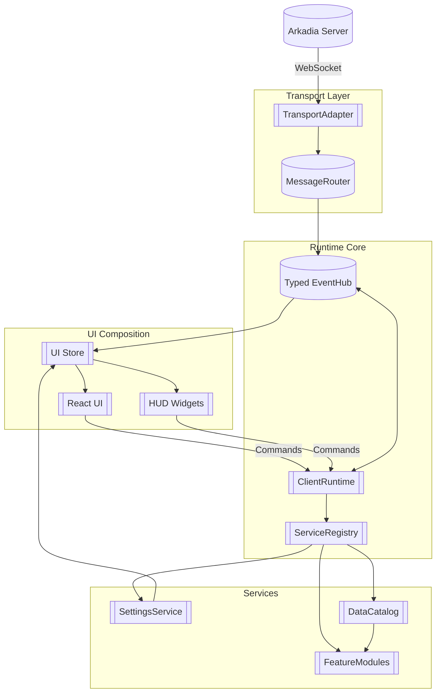

# Proposed Next-Generation Architecture

This document outlines a forward-looking architecture for the Arkadia web client
that removes the legacy window-based integration layer, retires compatibility
shims, and simplifies how settings and domain data flow between the runtime and
UI. The goal is to keep the script runtime powerful and composable while making
it easier to reason about configuration, transport, and UI updates.

## Guiding principles

1. **Single source of truth** – State should live in dedicated services instead
   of being mirrored across globals, DOM events, and storage listeners.
2. **Typed contracts** – Replace loosely typed `window` bridges with explicit
   TypeScript interfaces so modules can be developed, tested, and reused without
   knowledge of the browser shell.
3. **Reactive data flow** – Use reactive stores (e.g., RxJS subjects, Zustand,
   or Redux Toolkit) so both the script runtime and UI can consume the same
   state without bespoke wiring.
4. **Transport agnostic** – Decouple WebSocket specifics from the client
   runtime so other transports (e.g., offline replays, testing harnesses) can be
   plugged in without touching feature modules.
5. **Composable services** – Settings, data loaders, and domain helpers should
   be replaceable services that follow the same lifecycle as the client runtime.

## High-level component map



### Transport layer

- **TransportAdapter** abstracts away the WebSocket/Telnet specifics. It
  exposes a typed stream of inbound events (`onMessage(): Observable<TransportIn>`) and a
  command sink (`send(command: TransportOut)`).
- **MessageRouter** is responsible for decoding protocol frames (GMCP, ANSI
  text, prompts) and translating them into strongly typed runtime events before
  pushing them onto the `EventHub`.
- Eliminating the compatibility shim means the adapter no longer needs to fake
  global objects; instead, runtime modules subscribe directly to the router’s
  event streams.

### Runtime core

- **ClientRuntime** hosts the script features. It registers modules, subscribes
  to transport events, and issues outgoing commands. Instead of touching
  `window`, it receives dependencies through the constructor (transport,
  services, event hub).
- **EventHub** replaces the legacy event bus + `window` mirroring. It offers
  typed topics (e.g., `gmcp.char.vitals`, `output.chunk`, `settings.updated`).
  Both runtime modules and UI listeners subscribe through the same API, keeping
  cross-cutting features consistent.
- **ServiceRegistry** lifecycle-manages services (initialise, start, stop). This
  simplifies bootstrap logic, letting new services (like telemetry or offline
  caching) be added without editing the runtime core.

### Services

- **SettingsService** is the canonical source of configuration. It persists to
  storage (localStorage, IndexedDB, extension storage) through a pluggable
  backend. Consumers receive a reactive store (`settings$`) and write through a
  single `update(partial)` method. This removes duplicated logic between storage
  utilities and UI forms.
- **DataCatalog** coordinates domain data loading (maps, people, magics, herbs,
  keys). Loaders register themselves with metadata (version, TTL) and expose a
  `ready$` observable. Feature modules subscribe without needing manual
  bootstrap glue.
- **FeatureModules** are script packages that declare the events they require
  and the commands they emit. They receive `ClientContext` (transport send,
  event hub, settings snapshot, data catalog) and stay agnostic of the UI.

### UI composition

- **UIStore** is a dedicated state container (Zustand, Redux Toolkit, or RxJS).
  It consumes events from the `EventHub` and the `SettingsService`, projecting
  them into view models. HUD widgets and React panels select slices of this
  store instead of attaching to `window` events.
- **ReactShell** hosts panels (settings, triggers, map). These components read
  from the store and dispatch intents (e.g., `UIStore.dispatch(saveSettings)`).
- **HUD Widgets** (imperative overlays) subscribe to the same store so DOM
  manipulations remain in sync with React panels. Commands (movement, actions)
  go back to the runtime through the injected `CommandDispatcher` or store
  provided client bindings instead of writing to a global object.

## Interaction flow without window globals

1. **Bootstrap**
   - The web entry point instantiates `TransportAdapter`, `EventHub`,
     `SettingsService`, `DataCatalog`, and `ClientRuntime`.
   - `ClientRuntime` registers feature modules, wiring their subscriptions to the
     `EventHub` and `SettingsService`.
   - UI code instantiates `UIStore`, injecting the `EventHub` and
     `SettingsService`. No objects are placed on `window`.

2. **Runtime updates**
   - Incoming transport messages are decoded by `MessageRouter` and pushed to
     the `EventHub`.
   - Feature modules react (e.g., map loader updates `DataCatalog`, combat
     module emits alerts) and may send commands back via the transport adapter.
   - The `EventHub` relays structured events to the `UIStore`, which updates the
     HUD and React panels.

3. **Settings lifecycle**
   - UI panels call `SettingsService.update` with partial changes. The service
     persists the update and emits through `settings$`.
   - Feature modules and UI subscribers receive the same update event. No manual
     rebroadcasting through DOM events or `window` listeners is required.
   - Storage synchronisation (per character, per account) is handled inside the
     service using a pluggable persistence backend.

4. **Data loading**
   - When the runtime starts, `DataCatalog` loads cached snapshots. Fresh data
     requests are queued through the same service, which publishes readiness
     events to the `EventHub`.
   - Feature modules subscribe to dataset handles (`catalog.get("map")`) and
     receive updates when new versions arrive.
   - UI components (map, herb encyclopedia) subscribe to the same dataset stream
     via the `UIStore`, eliminating custom wiring.

## Browser lifecycle considerations

HUD widgets and React panels commonly subscribe to the shared UI store or other
in-memory services. Manual clean-up through `unload`/`beforeunload` listeners is
not required: browsers tear down event listeners, timers, and subscriptions
whenever the document is reloaded or navigated away. New code should therefore
avoid registering unload handlers solely to dispose of subscriptions—keeping the
page lifecycle free of redundant listeners ensures simpler, more predictable
teardown behaviour.

## Migration strategy

1. **Introduce the EventHub** alongside the existing event bus, gradually
   migrating modules to the typed API. Once consumers no longer depend on
   `window` mirroring, remove the compatibility layer.
2. **Build the SettingsService** with the current storage implementation behind
   an adapter. Migrate UI forms and script modules to the service, then delete
   direct localStorage access and `MockPort` shims.
3. **Refactor transport** by encapsulating the WebSocket logic into the new
   adapter and router. Ensure legacy `ArkadiaClient` delegates entirely to the
   adapter before removing it.
4. **Adopt the UIStore** for new UI features, then migrate existing widgets and
   React panels. Replace `window.clientExtension` calls with the injected
   `CommandDispatcher` or `uiStore` client bindings.
5. **Decommission legacy code** once all modules consume the new services:
   remove window globals, delete compatibility files, and simplify bootstrap
   scripts.

This architecture keeps the powerful feature module ecosystem while delivering
cleaner boundaries and a single reactive data flow between transport, runtime,
settings, data, and UI.

### Migrating third-party scripts away from `window.clientExtension`

Legacy extensions could reach runtime helpers by accessing `window.clientExtension`.
That surface has been replaced by explicit dependency injection through the
shared UI store:

1. Import the store utilities exposed by the client (`import { uiStore } from "web-client/ui/store";`).
2. Read injected services from `uiStore.getState().clientBindings`—the bindings
   include the runtime `Client`, map helper, trigger manager, output handler,
   team manager, and notification helpers.
3. Send commands or events through `uiStore.getState().sendCommand()` /
   `sendEvent()` (or by dispatching intents) instead of calling
   `clientExtension.sendCommand`.

Scripts that still require direct helpers should destructure them from the
bindings:

```ts
const { map, triggers } = uiStore.getState().clientBindings;
const currentRoomId = map?.currentRoom?.id;
const allTriggers = [...(triggers?.triggers.values() ?? [])];
```

Always wait until the UI store has been initialised (for example inside a
`DOMContentLoaded` listener) before reading the bindings to avoid race
conditions during bootstrap.
