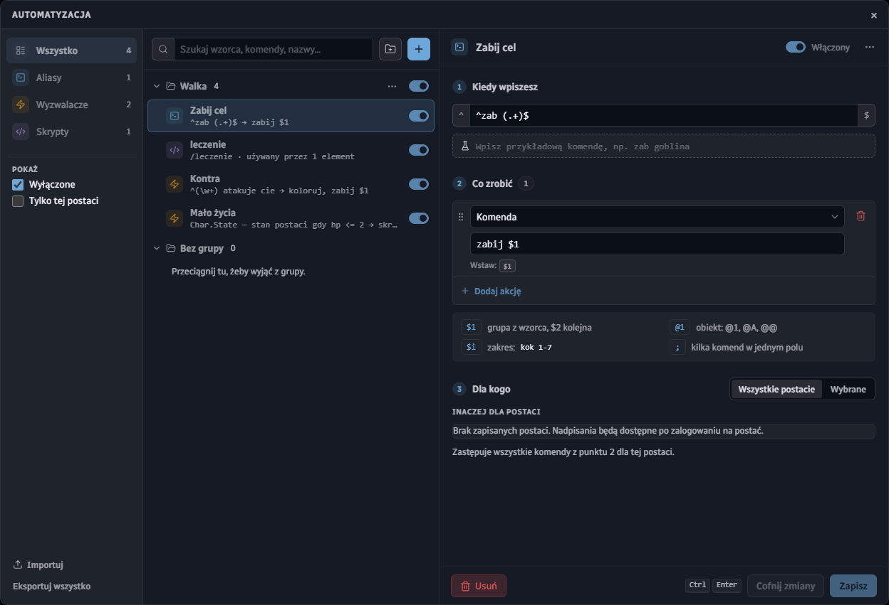
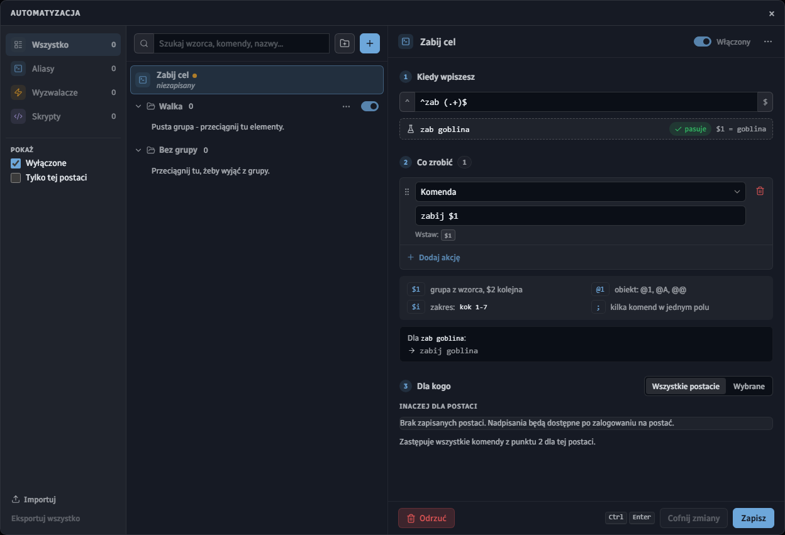
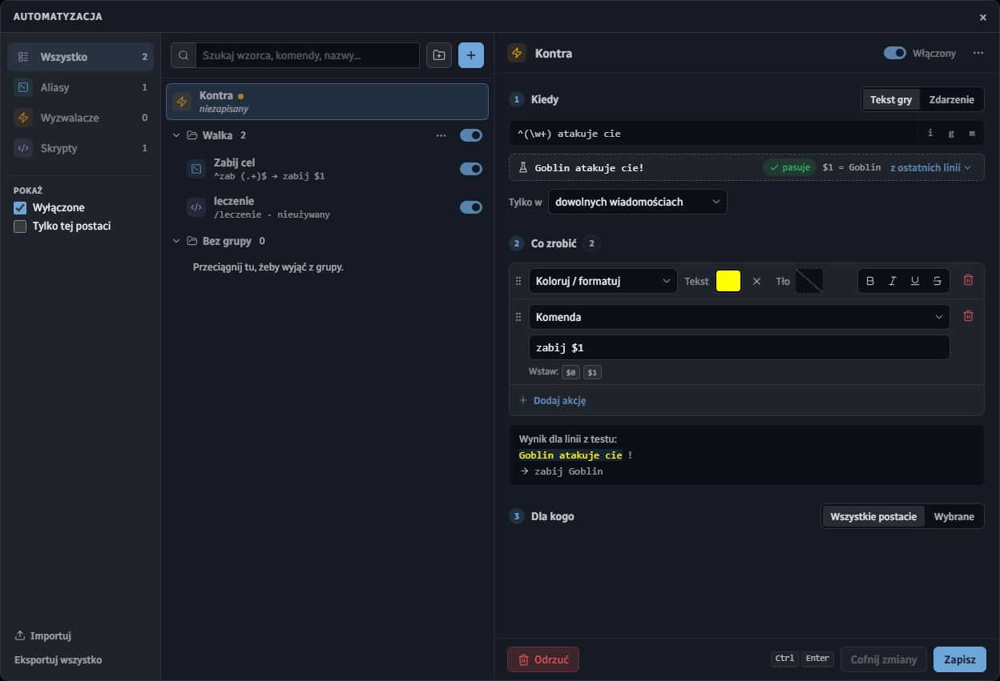
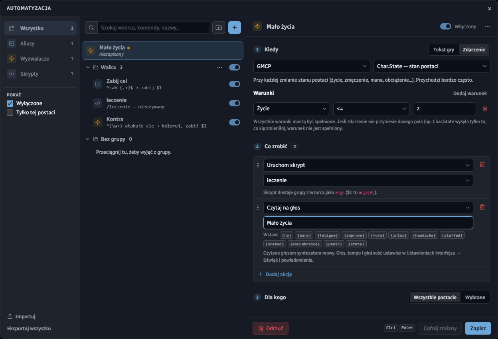
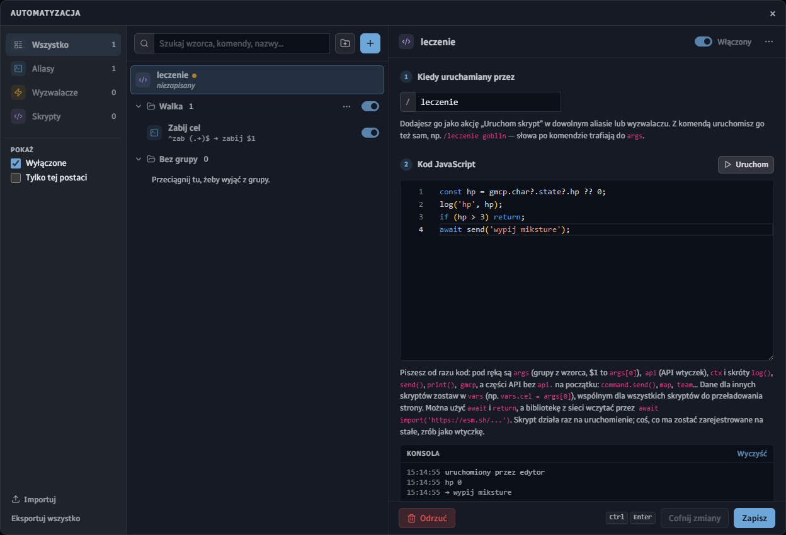

# Automatyzacje

Aliasy, wyzwalacze i skrypty tworzysz w jednym oknie: **Menu → Automatyzacja**. Nie trzeba pisać kodu — wystarczy wzorzec i lista akcji.

## Okno Automatyzacji

Okno ma trzy kolumny:

- **Po lewej** — filtr rodzaju (*Wszystko*, *Aliasy*, *Wyzwalacze*, *Skrypty*) z liczbą elementów. **Wyłączone** pokazuje też to, co wyłączyłeś, a **Tylko tej postaci** chowa to, co na zalogowanej postaci nie działa. Na dole **Importuj** i **Eksportuj wszystko**
- **Na środku** — lista w grupach, z polem **Szukaj** (po wzorcu, komendzie albo nazwie). Przycisk **+** dodaje alias, wyzwalacz, skrypt albo grupę; ikona folderu obok tworzy nową grupę
- **Po prawej** — edytor zaznaczonego elementu. **Zapisz** (albo `Ctrl+Enter`) zapisuje zmiany, **Cofnij zmiany** wraca do zapisanej wersji

Element ze zmianami, których jeszcze nie zapisałeś, ma przy nazwie pomarańczową kropkę. Przełącznik przy każdym wierszu włącza go i wyłącza bez otwierania edytora, a menu **…** pozwala go zduplikować, przenieść do innej grupy albo usunąć.

## Grupy

Grupa zbiera powiązane elementy — np. wszystko, czego używasz w walce. Jej przełącznik włącza i wyłącza całą grupę naraz.

- Elementy przenosisz między grupami, przeciągając je, albo z menu **…** przy elemencie
- Menu **…** przy grupie dodaje do niej nowy alias, wyzwalacz lub skrypt, zmienia jej nazwę i **eksportuje grupę** do pliku `.json`
- Taki plik ktoś inny wczyta przez **Importuj → Plik automatyzacji (.json)**
- Akcja **Włącz / wyłącz grupę** pozwala przełączać grupę z innego aliasu lub wyzwalacza — np. wejście w walkę włącza grupę "Walka", a jej koniec ją wyłącza

> Paczkę od kogoś obcego przejrzyj przed importem — zwłaszcza skrypty, bo mają dostęp do całego API klienta.

## Aliasy

Alias zamienia to, co wpisujesz, na komendę (albo kilka akcji). Dodajesz go przez **+ → Alias**.

1. **Kiedy wpiszesz** — wzorzec (wyrażenie regularne). Nawiasy łapią fragmenty: we wzorcu `^zab (.+)$` część po `zab ` trafia do `$1`. W polu z kolbą wpisz przykładową komendę, a od razu zobaczysz, czy pasuje i co trafi do `$1`
2. **Co zrobić** — lista akcji. Najczęściej **Komenda**, np. `zabij $1`. Pod listą jest ściągawka: `$1`, `$2` to grupy ze wzorca, `@1`, `@A`, `@@` to obiekty z lokacji, `$i` powtarza komendę dla każdej liczby z zakresu, który wpiszesz (np. `kok 1-7`), a `;` rozdziela kilka komend w jednym polu. Na dole widać, co alias wyśle dla przykładowej komendy
3. **Dla kogo** — wszystkie postacie albo tylko wybrane. W **Inaczej dla postaci** możesz podać inną komendę dla konkretnej postaci

Aliasy z innych klientów wczytasz przez **Importuj → Aliasy z klienta Arkadii** albo **Aliasy z Blowtorch**.

## Wyzwalacze

Wyzwalacz reaguje na to, co wypisze gra. Dodajesz go przez **+ → Wyzwalacz**.

1. **Kiedy** — przełącznik **Tekst gry** / **Zdarzenie**. Dla tekstu podajesz wzorzec; przyciski `i`, `g`, `m` po prawej to flagi (bez rozróżniania wielkości liter, globalnie, wieloliniowo)
2. **Linia do testu** — wpisz albo wybierz **z ostatnich linii** gry tekst, a zobaczysz, czy wzorzec pasuje, co jest w `$1` i jak linia będzie wyglądać po akcjach (**Wynik dla linii z testu**)
3. **Tylko w** — zawęża wyzwalacz do jednego rodzaju wiadomości: walki, rozmów, opisów lokacji, poczty i ponad 20 innych
4. **Co zrobić** — dowolnie wiele akcji, wykonywanych po kolei. Kolejność zmienisz, przeciągając za uchwyt po lewej

Akcje, które zmieniają linię na ekranie:

- **Koloruj / formatuj** — kolor tekstu i tła, pogrubienie, kursywa, podkreślenie, przekreślenie
- **Wielkie litery**, **Zamień**, **Otocz tekstem**
- **Wolne miganie**, **Szybkie miganie**, **Pulsowanie**

Akcje, które robią coś poza linią (działają też w aliasach i zdarzeniach):

- **Komenda** — wysyła komendę do gry, z `$1`, `$2` z wzorca
- **Dźwięk** — domyślny beep albo własny plik (**Dodaj dźwięk…**); **Wycisz dźwięki** / **Włącz dźwięki**
- **Powiadomienie** i **Powiadomienie na telefon**
- **Czytaj na głos** — głos, tempo i głośność ustawiasz w *Ustawieniach interfejsu → Dźwięk i powiadomienia*
- **Wypisz tekst** — wypisuje własny tekst w oknie gry
- **Funkcyjny bind** — ustawia, co zrobi klawisz funkcyjnego bindu
- **Uruchom skrypt** i **Włącz / wyłącz grupę**

Wtyczki mogą dodawać do tej listy własne akcje — pojawiają się na końcu, pod nazwą wtyczki.

## Wyzwalacze na zdarzenia

Zamiast tekstu wyzwalacz może reagować na zdarzenie: zabicie wroga, początek i koniec walki, ogłuszenie, atak na ciebie, niskie życie, połączenie i rozłączenie, transport (postój, przystanek, cel podróży) albo dane GMCP.

- Przełącz **Kiedy** na **Zdarzenie** i wybierz je z listy. Dla GMCP wybierasz jeszcze pakiet, np. *Char.State — stan postaci*
- **Warunki** zawężają zdarzenie — np. *Życie <= 2*. Wszystkie warunki muszą być spełnione
- W akcjach zamiast `$1` używasz pól zdarzenia, np. `{hp}` czy `{attacker}`. Przyciski pod polem tekstowym wstawiają je za ciebie

Na zrzucie wyzwalacz przy niskim życiu uruchamia skrypt "leczenie" i czyta na głos "Mało życia".

## Skrypty

Gdy akcje to za mało, piszesz krótki skrypt w JavaScripcie (**+ → Skrypt**).

- **Kiedy uruchamiany przez** — skrypt uruchamia akcja **Uruchom skrypt** w aliasie lub wyzwalaczu albo własna komenda: skrypt z komendą `leczenie` uruchomisz, wpisując `/leczenie`. Słowa po komendzie trafiają do `args`
- **Kod JavaScript** — piszesz od razu kod, bez funkcji dookoła. Masz pod ręką `send('komenda')`, `print('tekst')`, `log(...)`, dane `gmcp`, grupy z wzorca w `args` i całe API wtyczek w `api`. Działa `await` i `return`
- **Uruchom** — puszcza skrypt od razu, także niezapisany
- **Konsola** — pokazuje, kto uruchomił skrypt, co wypisał przez `log`, co wysłał do gry i jaki błąd go zatrzymał

Wiersz skryptu na liście mówi, przez ile elementów jest używany. Więcej o tym, co skrypt może zrobić, znajdziesz na stronie **Skrypty i wtyczki**.
